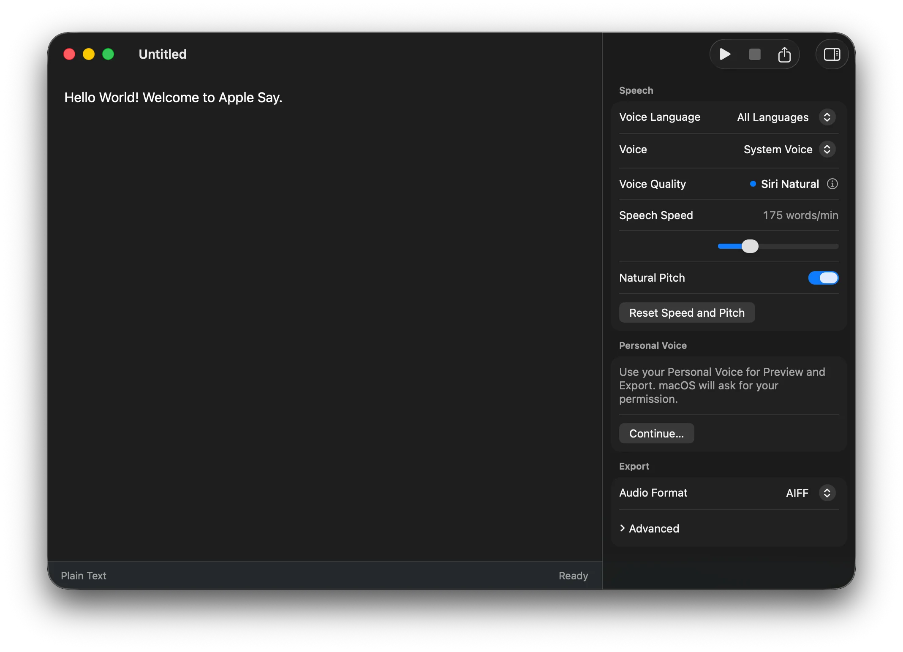

<div align="center">
  
  <h1>Apple Say</h1>
  <p><strong>A native macOS studio for speech synthesis, LRC, and Enhanced LRC timed text.</strong></p>

  <p>
    <a href="https://github.com/thedavidweng/apple-say/releases"></a>
    <a href="https://developer.apple.com/macos/"></a>
    <a href="https://www.swift.org"></a>
    <a href="#installation"></a>
    <a href="PRIVACY.md"></a>
  </p>

  <p>
    <a href="README.md"><strong>English</strong></a> •
    <a href="README_zh.md"><strong>简体中文</strong></a>
  </p>

  <br />
  
</div>

---

**Apple Say** is a native macOS studio for speech synthesis and timed audio. It writes, previews, and exports Plain Text, LRC, and Enhanced LRC documents using system voices and `/usr/bin/say` — fully local, offline, and subscription-free.

---

## ✨ Features

- 📄 **Direct Editor**: Start typing immediately; preview and export audio without saving first.
- ⏱️ **Timed Text**: Supports Plain Text, LRC (line-level), and Enhanced LRC (word-level) with automatic rate scaling.
- 🗣️ **System & Personal Voices**: Filter installed macOS voices by language; use Spoken Content Siri voices and authorized Personal Voice profiles.
- 🎛️ **Speech Inspector**: Tune speech rate, pitch, container formats (AAC, AIFF, WAV, CAF), channels, sample rates, and bitrates.
- 🎧 **Preview & Export**: Fast keyboard preview playback and standard save panel audio export.
- 🔒 **Local & Private**: On-device synthesis with zero network calls, telemetry, or external runtime dependencies.

---

## 🚀 Installation

### Homebrew (Recommended)

```bash
brew install --cask thedavidweng/tap/apple-say
```

Upgrade:

```bash
brew upgrade --cask apple-say
```

### Direct Download

1. Download `Apple-Say.dmg` from [GitHub Releases](https://github.com/thedavidweng/apple-say/releases).
2. Drag **Apple Say.app** into `/Applications`.
3. Launch from Applications or Spotlight.

> [!NOTE]
> Releases use ad-hoc signing. If Gatekeeper blocks launch, right-click **Apple Say.app** and select **Open**, or run:
> `xattr -cr "/Applications/Apple Say.app"`

---

## 📖 Supported Formats

Document formats are detected automatically:

- **Plain Text**: Continuous speech without timestamps.
- **LRC**: Line-level timestamps:
  ```lrc
  [00:02.00] Hello, welcome to Apple Say.
  [00:05.50] Line-level synchronized speech.
  ```
- **Enhanced LRC**: Word-level inline timestamps:
  ```lrc
  [00:01.00] <00:01.20> Precision <00:02.00> word-level <00:02.80> alignment.
  ```

Timing or syntax conflicts safely fall back to Plain Text or report a Timing Error without modifying document text.

---

## ⌨️ Keyboard Shortcuts

| Action | Shortcut |
| :--- | :--- |
| **Preview Speech** | `⌘ Return` |
| **Stop Playback** | `⌘ .` |
| **Export Audio** | `⇧ ⌘ E` |
| **Toggle Speech Inspector** | `⌥ ⌘ I` |

---

## 🛠️ Building from Source

### Prerequisites

- macOS 14.0+
- Xcode 26+ (Swift 6 toolchain and Icon Composer)

### Build & Run

```bash
git clone https://github.com/thedavidweng/apple-say.git
cd apple-say

# Build application bundle
./scripts/build-app.sh

# Launch app
open "build/Apple Say.app"
```

### Test & Package

```bash
# Run tests
swift test

# Build release artifacts in dist/
./scripts/package-release.sh
```

---

## 🛡️ Privacy & Permissions

Apple Say collects, stores, and transmits zero personal data.

- **System Speech**: Synthesized entirely on-device via native macOS APIs.
- **Personal Voice**: Prompts for native macOS authorization on first use; used strictly for user-requested speech preview and export.

Details in [PRIVACY.md](PRIVACY.md).

---

## 📄 Documentation & Contributing

- Domain vocabulary and specifications: [CONTEXT.md](CONTEXT.md)
- Contribution guidelines and pre-commit checks: [CONTRIBUTING.md](CONTRIBUTING.md)
- Issues and feature requests: [GitHub Issues](https://github.com/thedavidweng/apple-say/issues)
