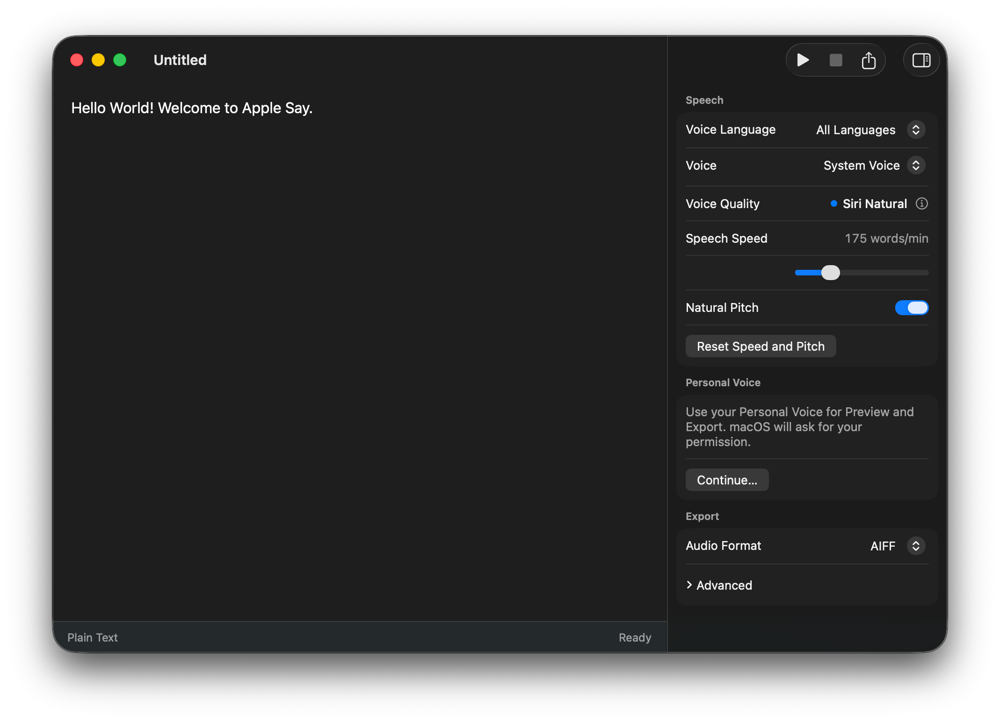

<div align="center">
  
  <h1>Apple Say</h1>
  <p><strong>基于 macOS 原生语音引擎的文本朗读、LRC 与增强型 LRC 时间轴音频工作台</strong></p>

  <p>
    <a href="https://github.com/thedavidweng/apple-say/releases"></a>
    <a href="https://developer.apple.com/macos/"></a>
    <a href="https://www.swift.org"></a>
    <a href="#安装指南"></a>
    <a href="PRIVACY.md"></a>
  </p>

  <p>
    <a href="README.md"><strong>English</strong></a> •
    <a href="README_zh.md"><strong>简体中文</strong></a>
  </p>

  <br />
  
</div>

---

**Apple Say** 是一款精致轻巧的原生 macOS 文档应用，专为文本朗读合成与时间轴音频制作打造。依托 macOS 内置的系统语音能力（`/usr/bin/say` 及原生语音合成器），你可以在同一编辑器内编写或打开纯文本、LRC 以及增强型 LRC 文档，即时试听朗读效果，并导出高品质音频文件。

所有处理过程均在本地 Mac 上完成——无需云端服务，无需联网，无任何订阅，彻底保护您的数据隐私。

---

## ✨ 核心特性

- 📄 **原生 macOS 文档体验**：采用标准 macOS 文档架构，完整支持多标签页、自动保存、历史版本追踪与 UTF-8 编码。
- ⏱️ **智能时间轴自适应**：无缝支持纯文本、LRC（行级时间戳）与增强型 LRC（字/片段级时间戳）。时间戳决定音频的绝对出现时刻，Apple Say 会自动测算渲染时长并在必要时动态加速语速，确保文字紧密契合下一个时间戳，绝不产生重叠或断句裁切。
- 🗣️ **系统声音与个人声音支持**：即时识别系统中已安装的所有语音，支持按语言筛选；原生支持 **系统声音（System Voice）**（无缝接入 Siri 自然拟真声音），更能调用经授权的 Apple **个人声音（Personal Voice）** 进行试听与导出。
- 🎛️ **专业的语音检视器（Speech Inspector）**：灵活调节语速与音高，自由选择输出容器格式（AAC、AIFF、WAV、CAF），并可深入配置声道数、采样率、比特率及音频转换质量。
- 🎧 **即时试听与音频导出**：通过便捷的快捷键随时试听播放当前段落，或通过 macOS 标准存储面板导出专业级音频文件。
- 🔒 **100% 离线与隐私安全**：完全在本地离线运行，零网络请求、零行为遥测、零数据搜集，不依赖任何第三方运行时。

---

## 🚀 安装指南

### 通过 Homebrew 安装（推荐）

通过 [thedavidweng/homebrew-tap](https://github.com/thedavidweng/homebrew-tap) 快速安装：

```bash
brew install --cask thedavidweng/tap/apple-say
```

后续更新应用只需运行：

```bash
brew upgrade --cask apple-say
```

### 手动下载安装

1. 前往 [GitHub Releases](https://github.com/thedavidweng/apple-say/releases) 页面下载最新的 `Apple-Say.dmg`。
2. 双击打开镜像，将 **Apple Say.app** 拖拽至系统的 `应用程序`（`/Applications`）目录。
3. 从“启动台”或“访达”中直接打开应用。

> [!NOTE]
> 预编译版本当前使用临时签名（ad-hoc signed）。首次打开若系统提示未签名或安全性警告，可右键单击 **Apple Say.app** 选择 **“打开”** 并确认，或在终端中执行：
> `xattr -cr "/Applications/Apple Say.app"`

---

## 📖 支持的文档格式

Apple Say 会根据语法结构自动识别文档模式：

- **纯文本（Plain Text）**：标准 UTF-8 文本，用于连续流畅的自然朗读。
- **LRC**：具有行级时间戳的对齐文本：
  ```lrc
  [00:02.00] 你好，欢迎使用 Apple Say。
  [00:05.50] 这是行级对齐的时间轴语音。
  ```
- **增强型 LRC（Enhanced LRC）**：具备字级或词组级行内时间戳的精准对齐文本：
  ```lrc
  [00:01.00] <00:01.20> 精准 <00:02.00> 逐字 <00:02.80> 朗读对齐。
  ```

当检测到语法冲突或超出物理限制的时序安排时，编辑器会以纯文本形式安全保留内容，或给出明确的**时序错误（Timing Error）**提示，绝不擅自篡改你的文本或移动时间戳。

---

## ⌨️ 常用快捷键

| 操作 | 快捷键 |
| :--- | :--- |
| **试听预览（Preview）** | `⌘ Return` |
| **停止播放（Stop）** | `⌘ .` |
| **导出音频（Export Audio）** | `⇧ ⌘ E` |
| **显示/隐藏语音检视器** | `⌥ ⌘ I` |

---

## 🛠️ 从源码构建

### 环境要求

- macOS 14.0 (Sonoma) 或更高版本
- 安装了 Swift 6.0 或更高版本的 Xcode Command Line Tools

### 构建步骤

```bash
# 克隆代码仓库
git clone https://github.com/thedavidweng/apple-say.git
cd apple-say

# 编译生成独立应用包
./scripts/build-app.sh

# 打开构建好的应用
open "build/Apple Say.app"
```

### 运行单元测试

```bash
swift test
```

### 打包发布产物

```bash
./scripts/package-release.sh
```

生成的安装包（`Apple-Say.dmg`、`Apple-Say.zip` 及 `checksums.txt`）将存放于 `dist/` 目录中。

---

## 🛡️ 隐私与系统权限

Apple Say 不会收集、存储、上传或共享任何个人数据。

- **系统语音**：所有语音合成完全在你的 Mac 本地通过 macOS 系统接口完成。
- **个人声音（Personal Voice）**：选用 macOS 个人声音时，系统会弹出授权请求。Apple Say 仅将该权限用于朗读与导出你指定的内容。

详细政策参见 [PRIVACY.md](PRIVACY.md)。

---

## 📄 规范与参与贡献

- 项目领域词汇与设计规范详见 [CONTEXT.md](CONTEXT.md)。
- 代码贡献准则与提交前检查清单详见 [CONTRIBUTING.md](CONTRIBUTING.md)。
- 欢迎通过 [GitHub Issues](https://github.com/thedavidweng/apple-say/issues) 提交问题反馈、功能建议或贡献代码。
